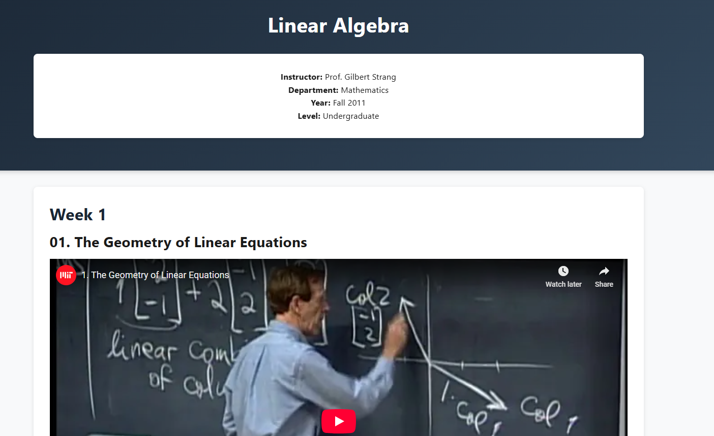

# Simple Linear Algebra Course Website

This project is an interactive web-based learning resource for Linear Algebra, featuring video lectures by Prof. Gilbert Strang. The course covers fundamental concepts of linear algebra with a focus on geometric interpretation and practical applications.

## Preview

Experience our interactive Linear Algebra course website live at: [Simple Linear Algebra Course](https://jimmyu2foru18.github.io/Simple-Linear-Algebra/)



## Features

- Comprehensive video lectures from MIT OpenCourseWare
- Structured weekly content organization
- Detailed notes and key concepts for each lecture
- Mobile-responsive design
- Clean and modern user interface

## Course Content

The course covers essential topics in Linear Algebra including:

- The Geometry of Linear Equations
- Elimination with Matrices
- Matrix Operations
- Vector Spaces and Subspaces
- And more...

## Getting Started

### Local Development

1. Clone the repository:
   ```bash
   git clone https://github.com/Jimmyu2foru18/Simple-Linear-Algebra.git
   ```

2. Open the project:
   - Simply open `index.html` in your web browser
   - Alternatively, use a local server:
     ```bash
     python -m http.server 8000
     ```
     Then visit `http://localhost:8000`

## Preview

Experience our interactive Linear Algebra course website live at: [Simple Linear Algebra Course](https://jimmyu2foru18.github.io/Simple-Linear-Algebra/)


## Deployment

This site is automatically deployed to GitHub Pages. You can access it at: https://jimmyu2foru18.github.io/Simple-Linear-Algebra/

## Contributing

Contributions are welcome! Please feel free to submit a Pull Request.

## License

This project is licensed under the MIT License

## Acknowledgments

- Prof. Gilbert Strang for the excellent lecture content
- MIT OpenCourseWare for making the lectures available
